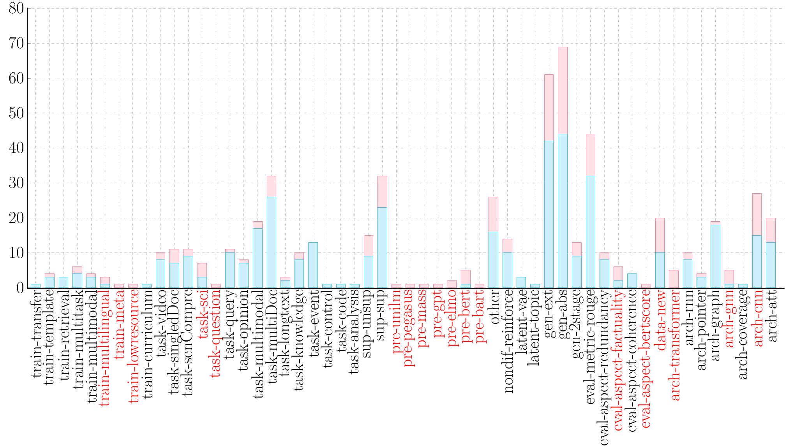

# Text Summarization Papers
by [Pengfei Liu](http://pfliu.com/), Yiran Chen, [Jinlan Fu](https://scholar.google.com/citations?hl=en&user=D4vtw8QAAAAJ), [Hiroaki Hayashi](https://hiroakih.me/),  Danqing Wang and other contributors.

An exhaustive paper list for **Text Summarization**,
covering papers from eight top conferences (*ACL / EMNLP / NAACL / ICML / ICLR / AAAI / IJCAI / NeurIPS*)  in the last eight years (*2013-2020*).  


## What can I get here?

### 1. [Paper Retrieval System **[Click Me !!!]** &#x1F53D;](http://pfliu.com/pl-summarization/summ_paper.html)

* Find the **top-cited** summarization papers! [The latest update on: 02.25/2020]
* Track the **latest** summarization papers!
* Find the **milestone** summarization papers for beginners.
* Search papers by [**research concepts**](https://github.com/neulab/Text-Summarization-Papers/blob/master/summ_concept.md) or your interested **keywords**.


### 2. What are the recent Research Concepts and which are HOT?

We first define the typology of essential [concepts](https://github.com/neulab/Text-Summarization-Papers/blob/master/summ_concept.md) for the summarization task. We then plot the number of papers for each concept below.

 denotes the number of papers **before 2019**.
<br>

 denotes the number of papers **since 2019**.
<br>

<p align="center"></p>

#### `Trends in 2019`:
 Concepts in red suggest HOT topics, and we can observe:

* **Task**: Scientific paper-based summarization has gain growing interests.
* **Data**: More new datasets are constructed.
* **Architecture**: Pretrained models and graph neural networks prevail.
* **Evaluation**: Evaluation of the generated summary's factuality attracts recent attention.

```
Hot topic: when the proportion of papers on a concept since 2019 is greater than a certain threshold (0.4), we define this concept as a hot topic.
```

### 3. Recommended Papers

#### Papers with Hot Topics
* [`pre-X`](http://pfliu.com/pl-summarization/summ_paper_preX.html): summarizer with unsupervised pretrained models.
* [`task-sci`](http://pfliu.com/pl-summarization/summ_paper_task-sci.html): scientifc paper-based summarization.
* [`eval-factuality`](http://pfliu.com/pl-summarization/summ_paper_factuality.html): factuality evaluation on generated summaries.
* [`arch-gnn`](http://pfliu.com/pl-summarization/summ_paper_arch-gnn.html): graph neural network-based summarizers.
* [`data-new`](http://pfliu.com/pl-summarization/summ_paper_data-new.html): more new datasets are constructed.


#### Milestone Papers
* [10 must-read papers for neural **extractive** summarization](http://pfliu.com/pl-summarization/summ_paper_gen-ext.html)
* [10 must-read papers for neural **abstractive** summarization](http://pfliu.com/pl-summarization/summ_paper_gen-abs.html)
* [Top 10 **most-cited** summarization papers since 2014](http://pfliu.com/pl-summarization/summ_paper_topcited.html)


### 4. Mainstream [Dataset List &#x1F53D;](http://pfliu.com/pl-summarization/summ_data.html)


## What can I do here?
* ### If you have a new "research concept"  -- Tell us
	* **Update** the file [`summ_concept.md`](https://github.com/neulab/Text-Summarization-Papers/blob/master/summ_concept.md) and send us a `Pull request`.
	* Or you could open an `Issue`.

* ### If you have a new "paper" or want to modify our inaccurate annotations of concepts: 
	* **Update** your paper into the file [`summ_paper.crowdsource`](https://github.com/neulab/Text-Summarization-Papers/blob/master/summ_paper.crowdsource) and send us a `Pull request`.
	* Or you could open an `Issue`.

* ### If you have a new "dataset" or want to modify our inaccurate annotations:
	* **Add** your dataset (If possible, with a brief description) into [`summ_data.crowdsource`](https://github.com/neulab/Text-Summarization-Papers/blob/master/summ_data.crowdsource) and send us a `Pull request`.
	* Or you could open an `Issue`.


## Related Work

* [Concepts in Neural Networks for NLP](https://github.com/pfliu-nlp/nn4nlp-concepts)
* [Named Entity Recognition Paper List](https://github.com/pfliu-nlp/Named-Entity-Recognition-NER-Papers)
* [Historiography of Text Summarization](http://pfliu.com/Historiography/summarization/summ-eng.html)


## Future Work
Hopefully, you will see our version-2.0 covering papers from 1980 to 2020. 


## Acknowledgments
* Thanks Prof. [Graham Neubig](http://www.phontron.com/)'s idea on the "concept" and other comments.
* Thanks Prof. [Fei Liu](http://www.cs.ucf.edu/~feiliu/) for providing us with a bunch of interesting work and description, which enriches our concept file.
* Thanks [Peter J. Liu] a lot (https://research.google/people/105182/) for crowdsourcing idea of the paper and dataset annotation. Feel free to correct our wrong annotations by updating [`summ_paper.crowdsource`](https://github.com/neulab/Text-Summarization-Papers/blob/master/summ_paper.crowdsource) and [`summ_data.crowdsource`](https://github.com/neulab/Text-Summarization-Papers/blob/master/summ_data.crowdsource).
